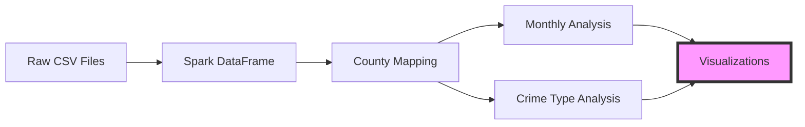

## Introduction

In this analysis, we dive deep into the crime patterns of three English counties - Derbyshire, Kent, and Leicestershire - throughout 2022. Using Apache Spark for data processing and various Python visualization libraries, we uncover interesting patterns and insights about crime rates and types across these regions.

## Data Processing Pipeline

Let's first look at how the data flows through our analysis pipeline:



## Key Findings

### Total Crime Distribution

The analysis revealed significant variations in total crime numbers across the three counties:

```echarts
{
  "title": {
    "text": "Total Crimes by County (2022)",
    "left": "center"
  },
  "tooltip": {
    "trigger": "axis",
    "formatter": "{b}: {c}"
  },
  "xAxis": {
    "type": "category",
    "data": ["Kent", "Leicestershire", "Derbyshire"],
    "axisLabel": {
      "rotate": 0
    }
  },
  "yAxis": {
    "type": "value",
    "name": "Number of Crimes"
  },
  "series": [{
    "data": [200945, 115179, 110805],
    "type": "bar",
    "itemStyle": {
      "color": {
        "type": "linear",
        "x": 0,
        "y": 0,
        "x2": 0,
        "y2": 1,
        "colorStops": [{
          "offset": 0,
          "color": "#83bff6"
        }, {
          "offset": 0.5,
          "color": "#188df0"
        }, {
          "offset": 1,
          "color": "#188df0"
        }]
      }
    }
  }]
}
```

### Monthly Crime Trends

The monthly analysis revealed interesting seasonal patterns:

```echarts
{
  "title": {
    "text": "Monthly Crime Trends (2022)",
    "left": "center"
  },
  "tooltip": {
    "trigger": "axis"
  },
  "legend": {
    "data": ["Kent", "Leicestershire", "Derbyshire"],
    "top": "30px"
  },
  "xAxis": {
    "type": "category",
    "data": ["Jan", "Feb", "Mar", "Apr", "May", "Jun", "Jul", "Aug", "Sep", "Oct", "Nov", "Dec"]
  },
  "yAxis": {
    "type": "value",
    "name": "Number of Crimes"
  },
  "series": [
    {
      "name": "Kent",
      "type": "line",
      "smooth": true,
      "data": [16338, 15383, 17310, 17144, 17546, 17388, 17950, 18365, 16574, 16172, 15799, 14976]
    },
    {
      "name": "Leicestershire",
      "type": "line",
      "smooth": true,
      "data": [8730, 8482, 10019, 9494, 10332, 9980, 10056, 10373, 9492, 9802, 9816, 8603]
    },
    {
      "name": "Derbyshire",
      "type": "line",
      "smooth": true,
      "data": [8991, 8452, 9598, 9409, 10140, 9710, 10017, 9571, 8781, 9205, 8923, 8008]
    }
  ]
}
```

### Crime Type Distribution

Here's a typogram showing the hierarchy of most common crimes:

```typograms
+------------------------+
|  Violence & Sexual     |
|     Offenses          |
|   (Most Common)       |
+------------------------+
          |
          v
+------------------------+
|   Property Crime       |
|  (Medium Frequency)    |
+------------------------+
          |
          v
+------------------------+
| Theft from Person      |
| Robbery/Bicycle Theft  |
|   (Least Common)       |
+------------------------+
```

## Technical Implementation

The analysis was implemented using several key technologies:

- **Apache Spark**: For large-scale data processing
- **Pandas**: For data manipulation and preparation
- **Matplotlib/Seaborn**: For visualization
- **Python**: As the primary programming language

Here's a glimpse of the core data processing code:

```python
# Add county mapping
df = df.withColumn(
    "County",
    F.when(F.col("Reported by") == "Derbyshire Constabulary", "Derbyshire")
     .when(F.col("Reported by") == "Kent Police", "Kent")
     .when(F.col("Reported by") == "Leicestershire Police", "Leicestershire")
     .otherwise(None)
)

# Calculate crime statistics
crime_count_query = """
SELECT County, COUNT(*) AS total_crimes
FROM crime_data
WHERE YEAR(Month) = 2022
GROUP BY County
ORDER BY total_crimes DESC
"""
```

## Key Insights

1. **Geographic Distribution**
   - Kent reported the highest number of crimes (200,945)
   - Leicestershire and Derbyshire had similar totals (115,179 and 110,805 respectively)

2. **Seasonal Patterns**
   - Peak crime months: August (Kent), May (Derbyshire)
   - Lower crime rates generally observed in winter months

3. **Crime Types**
   - Violence and sexual offenses were most common across all counties
   - Least common crimes varied:
     - Kent: Theft from person (1,007 cases)
     - Leicestershire: Robbery (811 cases)
     - Derbyshire: Bicycle theft (604 cases)

## Conclusions

This analysis provides valuable insights into crime patterns across three English counties. The data shows significant regional variations in both the volume and types of crimes reported. Kent consistently showed higher crime numbers, likely due to its larger population and geographic area. The seasonal patterns suggest that crime rates tend to increase during warmer months, with a notable peak in August for Kent.

## Future Work

Future analyses could include:
- Demographic correlations
- Weather impact analysis
- Socioeconomic factor integration
- Machine learning for crime prediction

---

**Note**: All data used in this analysis is from public sources and relates to the year 2022. The analysis is intended for educational purposes only.
